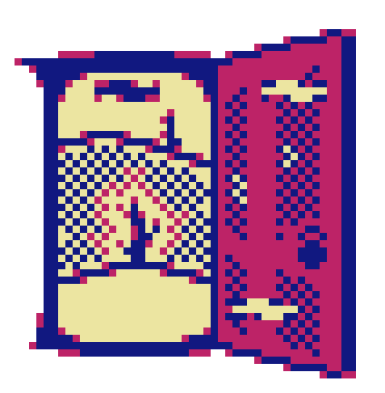

<h3 align="center">✨ <em>WELCOME, TO THE WORLD OF TOMORROW</em> ✨</h3>
<!-- Why do you always say it like that? -->

  Hey, I'm <strong>Nico</strong>! Software engineer, computer nerd, and chronic rabbit-hole explorer from Brooklyn. 
  I've been fascinated by how games and computers work for about as long as I can remember.

  <a href="https://www.linkedin.com/in/nicoaroca12/">𝑳𝒊𝒏𝒌𝒆𝒅𝑰𝒏</a>
  &nbsp; ▼ &nbsp;
  <a href="https://nicoaroca.dev">𝑴𝒚 𝒐𝒘𝒏 𝒑𝒆𝒓𝒔𝒐𝒏𝒂𝒍 𝑺𝒊𝒕𝒆
</a>
  &nbsp; ▼ &nbsp;
  <a href="mailto:nicoaroca.isworking@gmail.com">𝒆𝑴𝒂𝒊𝒍</a>

<h1></h1>

  

  <kbd>
     
    &nbsp;&nbsp;&nbsp;&nbsp; ▼ 𝑻𝑯𝑬𝑹𝑬'𝑺 𝑨𝑳𝑾𝑨𝒀𝑺 𝑨𝑵𝑶𝑻𝑯𝑬𝑹 𝑫𝑶𝑶𝑹 ▼ &nbsp;&nbsp;&nbsp;&nbsp;
      
  </kbd>

 

  I make things because I want to know how they work. 
  Sometimes that's a web app. Sometimes it's an AI agent, a renderer, a game,
  or some tool I probably could have downloaded instead.

  <strong>Right now I'm somewhere around:</strong>  
  · AI systems · graphics programming · game development · full-stack web software · developer tools · Linux · old hardware · 
  and an unreasonable amount of software archaeology

 

  <code>TypeScript</code>
  <code>Python</code>
  <code>C++</code>
  <code>SQL</code>
  <code>React</code>
  <code>LangGraph</code>
  <code>OpenGL</code>
  <code>Linux</code>

 

<!-- <h1></h1> -->

  

  <kbd>
     
    &nbsp;&nbsp;&nbsp;&nbsp; ▼ 𝐁𝐔𝐈𝐋𝐓 𝐒𝐎𝐌𝐄𝐖𝐇𝐄𝐑𝐄 𝐈𝐍 𝐁𝐑𝐎𝐎𝐊𝐋𝐘𝐍, 𝐍𝐄𝐖 𝐘𝐎𝐑𝐊. 𝐞𝐬𝐭. 𝟐𝟎𝐗𝐗 ▼ &nbsp;&nbsp;&nbsp;&nbsp;
      
  </kbd>

<!-- 𝟐𝟎𝐗𝐗 -->
<!-- 𝟐𝟎𝟎𝟓 -->
